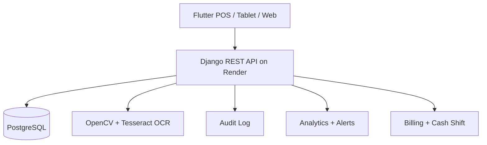

# Architecture

## Service Layers

- `frontend/`
  - POS workflow for entry, exit, payment, alerts, reports, and admin pricing
  - Responsive layout for tablet and web
  - Offline queue for retrying entry, exit, and payment operations

- `project/` and `apps/`
  - `accounts`: JWT auth, user roles, and session logging
  - `parking`: vehicles, zones, slots, and parking sessions
  - `billing`: pricing policy, cash payment, and shift reconciliation
  - `camera`: image upload, OCR preprocessing, and plate extraction
  - `analytics`: reports, anomaly detection, and chatbot-style queries
  - `audit`: immutable action log
  - `config`: system settings and admin configuration

## Request Flow

1. Staff logs in with JWT.
2. Flutter captures a plate image or manual plate input.
3. Django OCR endpoint returns a suggested plate.
4. Operator confirms or edits the plate.
5. Entry creates a session and assigns a slot.
6. Exit calculates the fee with the session's historical pricing snapshot.
7. Cashier confirms payment.
8. Session closes, the slot is released, and the audit log is written.

